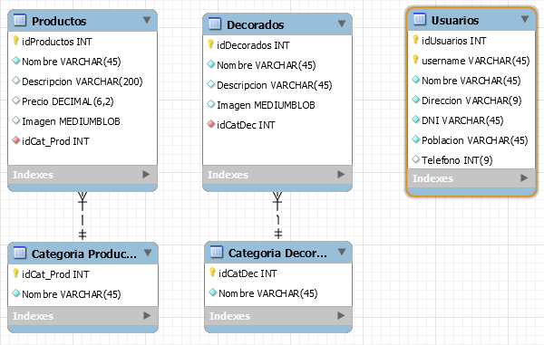
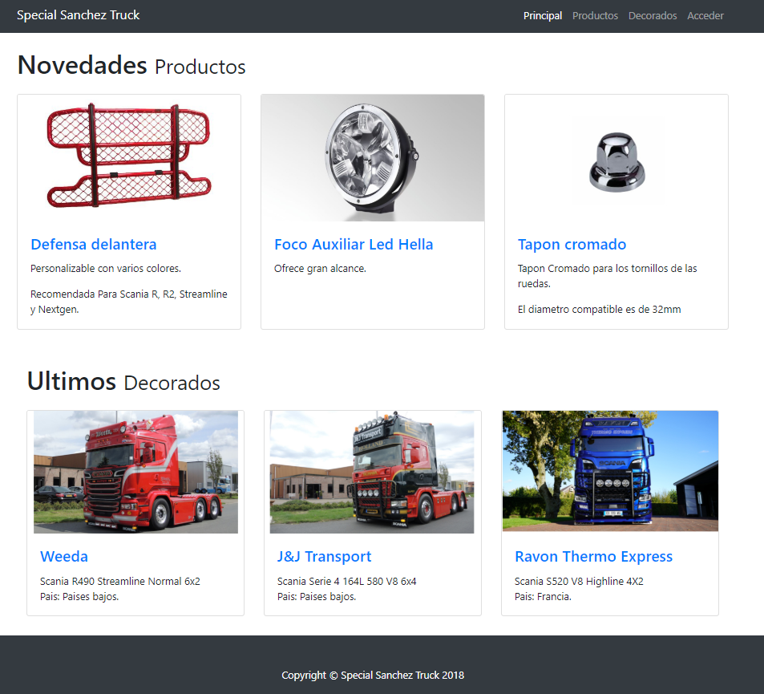
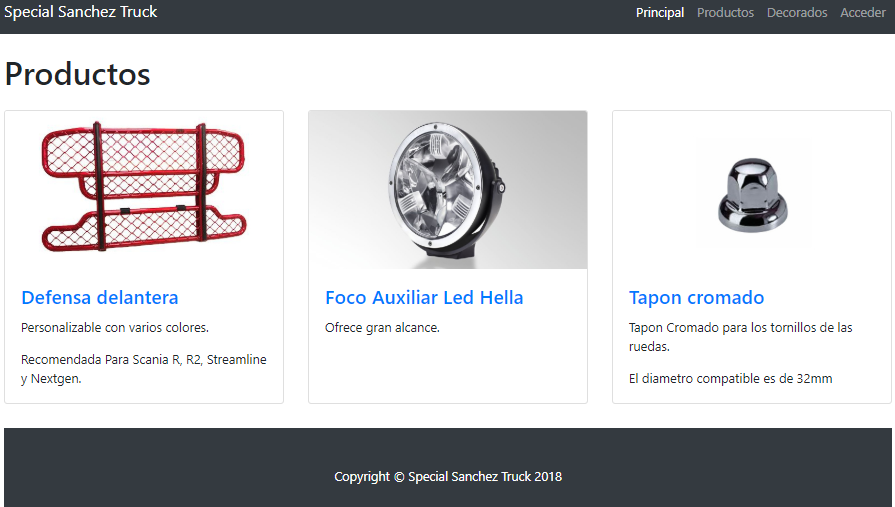
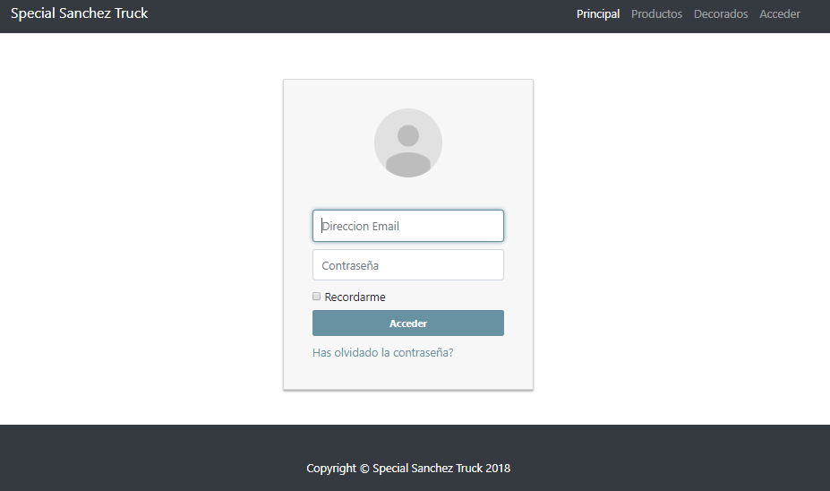

# SpecialSanchezTruck

## Especificació del projecte SpecialSanchezTruck

### 1. Introducció

* **Títol del projecte**: SpecialSanchezTruck
* **Objectius**: 
  * Desenvolupar una aplicació amb una tenda online de prouctes i accessoris per a decorar camions i tambe de exemples de decorats de camions i una descripcio.
* **Descripció**: El projecte que plantege, SpecialSanchezTruck és una tenda online orientada a la venta de productes i accessoris per a camions. Tambe hi haura una part de notícies amb decorats de exemple.
* **Desenvolupador**: @sanchezasix
* **Adreça web en Github:** https://github.com/2ASIX2018/SpecialSanchezTruck

### 2. Disseny

L'aplicació farà ús de dos taules per a gestionar els accessoris i productes, altres dos per a gestionar els exemples de decorats de la base de dades, i altra taula per a gestionar els usuaris.

#### 2.1. Descripció de la base de dades

L'esquema de la base de dades és la següent:

#### 2.2. Descripció de la interfície

Les diferents pàgines què tindra la pagina web.

* **Pàgina inicial**: Mostrara les novetats tant de productes com de decorats de camions.

* **Pàgina Productes**: Es ahon estaran tots els productes que estiguen a la venta o proximament estiguen.

* **Pàgina Decorats**: Estaran tots els decorats publicats.

* **Pàgina Access de Usuaris**:

### 3. Tasques a realitzar i calendarització

| Tasca | Dates de realització |
|------|-------------|
| Creació de les diferents pagines | del 29/10 al 5/11 |
| Donarli una apareça millor |del 29/10 al 5/11  |
| Anyadir una pagina de registres per a usuari i controlar les sessions |del 5/11 al 18/11  |
| Pulir la base de dades i crearla |del 10/11 al 20/11  |