# SpecialSanchezTruck

## Especificació del projecte SpecialSanchezTruck

### 1. Introducció

* **Títol del projecte**: SpecialSanchezTruck
* **Objectius**: 
  Desenvolupar una aplicació amb una tenda online de productes i accessoris per a decorar camions i també d'exemples de decorats de camions i una descripció.
* **Descripció**: El projecte que plantege, SpecialSanchezTruck és una tenda online orientada a la venta de productes i accessoris per a camions. També hi haurà una part de notícies amb decorats de exemple.
* **Desenvolupador**: @sanchezasix
* **Adreça web en Github:** https://github.com/2ASIX2018/SpecialSanchezTruck

## SpecialSanchezTruck  Sprint 1: 

### 2. Disseny

L'aplicació farà ús de dos taules per a gestionar els accessoris i productes, altres dos per a gestionar els exemples de decorats, i altra taula per a gestionar els usuaris.

#### 2.1. Descripció de la base de dades

L'esquema de la base de dades és la següent:

#### 2.2. Descripció de la interfície

Les diferents pàgines què tindra la pagina web.

* **Pàgina inicial**: Mostrara les novetats tant de productes com de decorats de camions.

* **Pàgina Productes**: Es ah on estaran tots els productes que estiguen a la venta o proximament estiguen.

* **Pàgina Decorats**: Estaran tots els decorats publicats.

* **Pàgina Accés de Usuaris**:

## SpecialSanchezTruck  Sprint 2:

* **Control de sessions**
    * **Pagines que s'adapten segons el usuari**

* **Formulari de registre:**
    * **Comprobacions de dades de introduccio**
    * **Pagina que rep les dades del formulari de registre**

* **Formulari de login**
    * **Comprobacions de usuaris**

* **Formulari de introduccio de productes**
    * **Comprobacions de dades de introduccio**
    * **Pagina que rep les dades del formulari de introduccio de productes**

* **Tancament de session**

### Pagina de inici per a usuaris no registrats.
* **Tindran la opcio de accedir per poder entrar a la pagina de login**
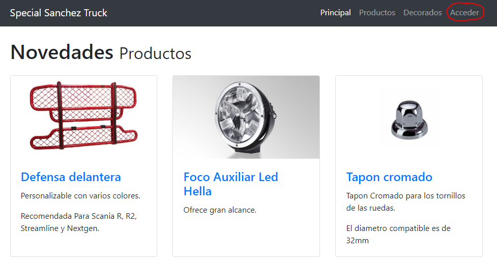

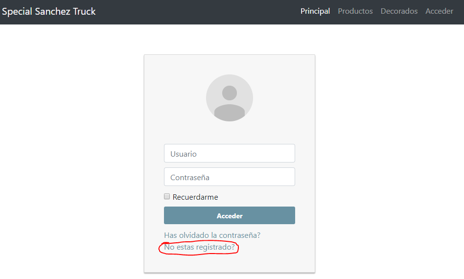

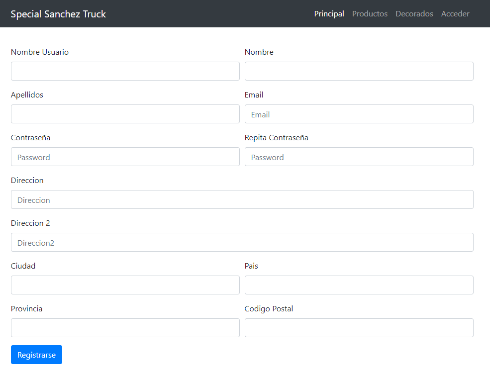

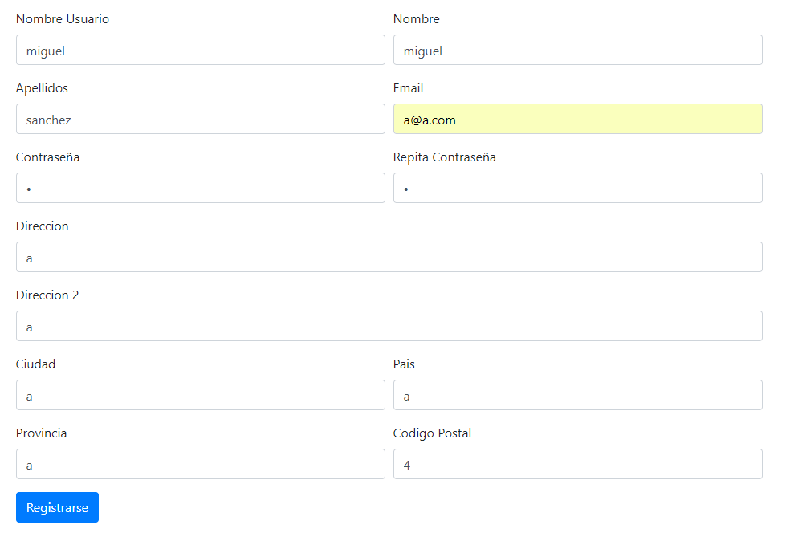

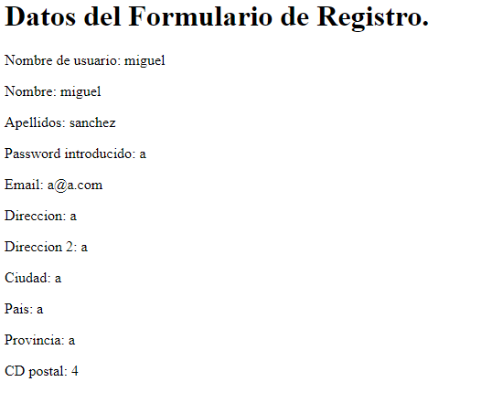

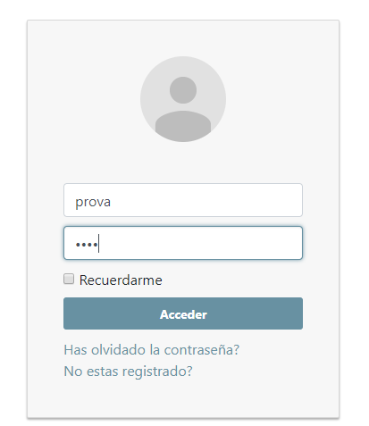

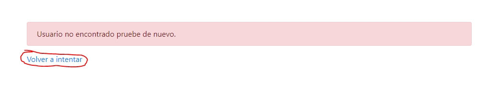

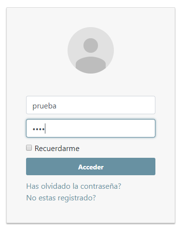

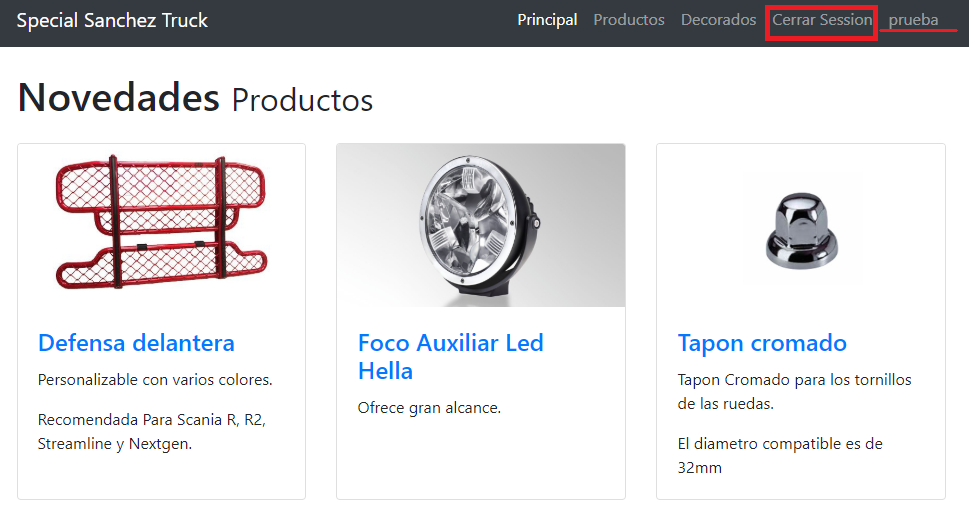

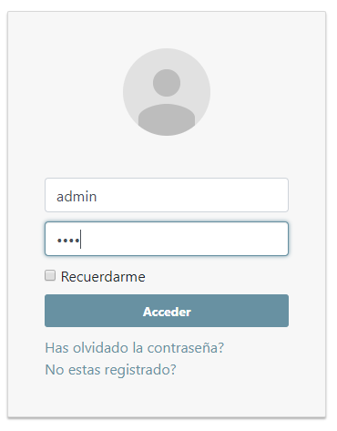

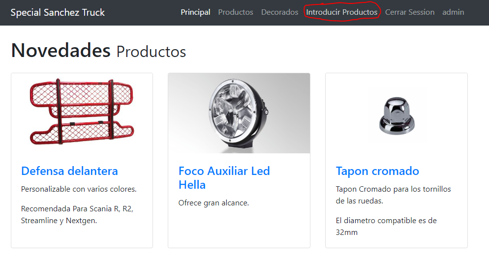

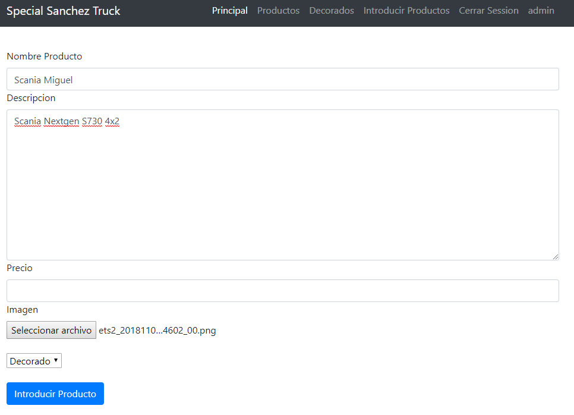

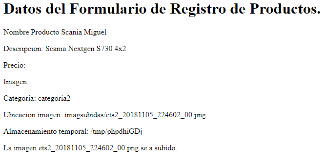

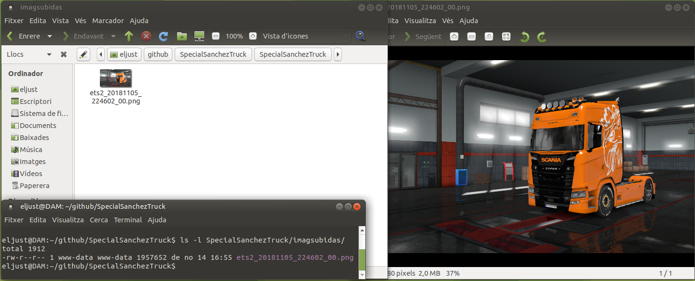

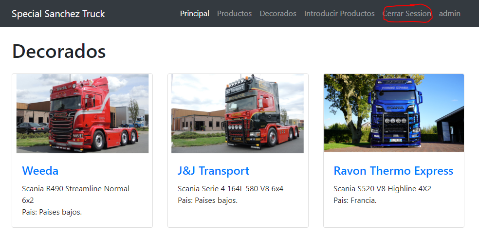

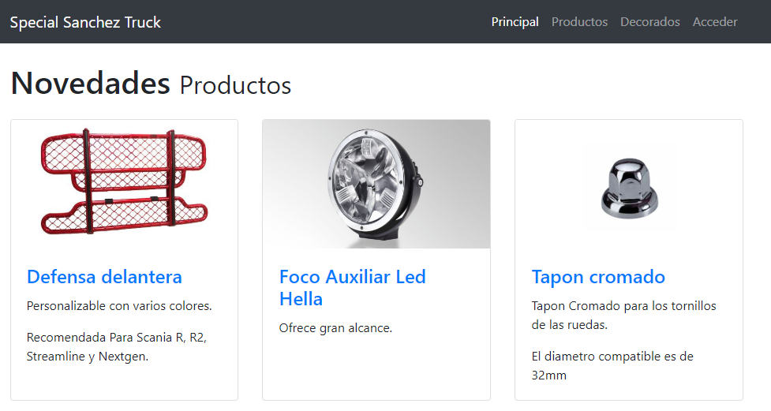

### Tasques a realitzar i calendari previst

| Tasca | Dates de realització |
|------|-------------|
| Creació de les diferents pagines | del 29/10 al 5/11 |
| Donarli una apareça millor |del 29/10 al 5/11  |
| Anyadir una pagina de registres per a usuari i controlar les sessions |del 5/11 al 18/11  |
| Pulir la base de dades i crearla |del 10/11 al 20/11  |