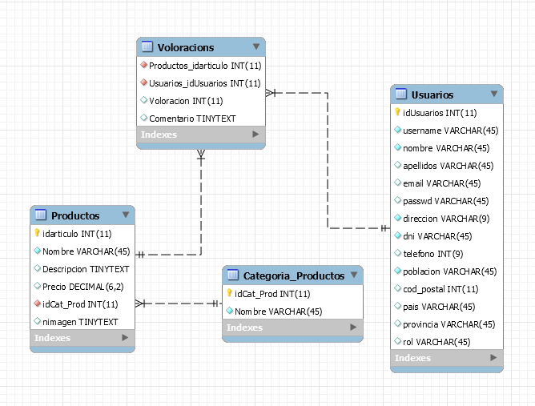
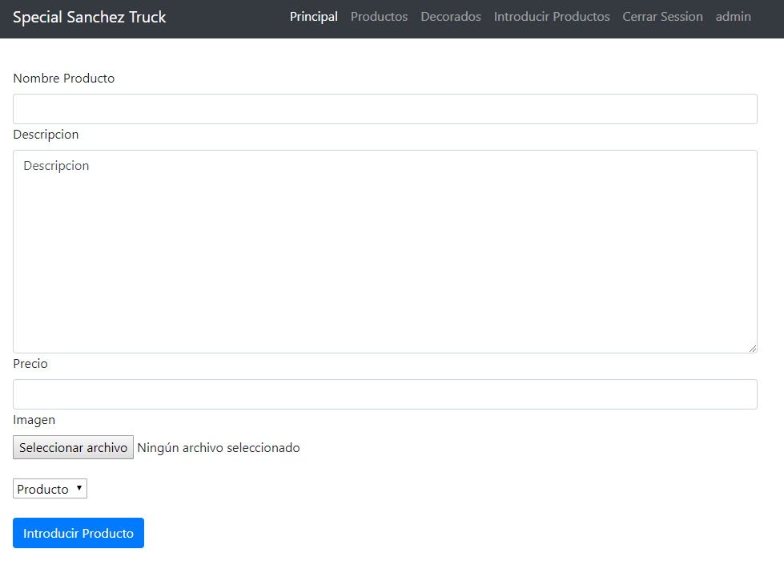

# SpecialSanchezTruck

## Especificació del projecte SpecialSanchezTruck

### 1. Introducció

* **Títol del projecte**: SpecialSanchezTruck
* **Objectius**: 
  Desenvolupar una aplicació amb una tenda online de productes i accessoris per a decorar camions i també d'exemples de decorats de camions i una descripció.
* **Descripció**: El projecte que plantege, SpecialSanchezTruck és una tenda online orientada a la venta de productes i accessoris per a camions. També hi haurà una part de notícies amb decorats de exemple.
* **Desenvolupador**: @sanchezasix
* **Adreça web en Github:** https://github.com/2ASIX2018/SpecialSanchezTruck

## SpecialSanchezTruck  Sprint 1: 

### 2. Disseny

L'aplicació farà ús de dos taules per a gestionar els accessoris i productes, altres dos per a gestionar els exemples de decorats, i altra taula per a gestionar els usuaris.

#### 2.1. Descripció de la base de dades

L'esquema de la base de dades és la següent:

#### 2.2. Descripció de la interfície

Les diferents pàgines què tindra la pagina web.

* **Pàgina inicial**: Mostrara les novetats tant de productes com de decorats de camions.

* **Pàgina Productes**: Es ah on estaran tots els productes que estiguen a la venta o proximament estiguen.

* **Pàgina Decorats**: Estaran tots els decorats publicats.

* **Pàgina Accés de Usuaris**:

## SpecialSanchezTruck  Sprint 2:

* **Control de sessions**
    * **Pagines que s'adapten segons el usuari**

* **Formulari de registre:**
    * **Comprovacions de dades de introducció**
    * **Pagina que rep les dades del formulari de registre**

* **Formulari de login**
    * **Comprovacions de usuaris**

* **Formulari de introducció de productes**
    * **Comprovacions de dades de introducció**
    * **Pagina que rep les dades del formulari de introducció de productes**

* **Tancament de sessions**

### Pagina de inici per a usuaris no registrats.

* **Tindran l'opció de accedir per poder entrar a la pagina de login**

    

### Pagina de inici login (formulari de login).

* **Per a usuaris no registrats esta disponible la opció "No estas registrado?" per accedir al formulari de registre**

    
    
### Pagina de Formulari de registre.

* **Te camps requerits que si no els plenem no ens deixar enviar les dades de registre**

    

    

* **Una vegada tots els camps requerits estan plens i pressionem en "Registrarse" se enviaran les dades a una pagina de recollida de dades**

    
    
### Control de usuaris registrats.

* **Si introduïm un usuari que no esta registrat:**

    

  **Ens apareixerà el següent error amb la opció de pressionar en "Volver a intentar" redireccionara a la pagina de login**

    

* **Si introduïm un usuari que esta registrat:**

    

* **Si el usuari es de rol user o lo que es el mateix un usuari registrat normal apareixeran aquestes opcions:**

    

* **Usuari Admin o usuari amb rol admin:**

    

  **Si el usuari es de rol admin apareixera la opció "Introducir Productos" que es una opcio que soles pot tindre els usuaris admins:**

    
    
### Formulari de introducció de productes.

* **Formulari que permet apart de introduir el nom del producte, la descripció, el preu(opcional), permet introduir imatges i que es guarden al servidor, i també segon el que siga si es un producte o un decorat, podem seleccionar la categoria del que introduïm.**

    

    

* **Una vegada tots els camps requerits estan plens i pressionem en "Introducir Producto" se enviaran les dades a una pagina de recollida de dades**

    

* **Comprovació de que es pugen les imatges al servidor**

    

### Tancament de sessions

* **Esta opció apareixerà per a tots els usuaris que estiguen logetgats**

    

* **Una vegada tanquem la sessió ens redirigix a la pagina de inici com a usuari Anonim**

    

### Tasques a realitzar i calendari previst

| Tasca | Dates de realització |
|------|-------------|
| Creació de les diferents pagines | del 29/10 al 5/11 |
| Donarli una apareça millor |del 29/10 al 5/11  |
| Anyadir una pagina de registres per a usuari i controlar les sessions |del 5/11 al 18/11  |
| Pulir la base de dades i crearla |del 10/11 al 20/11  |